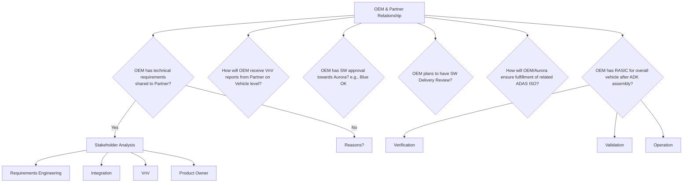

```mermaid
flowchart TD
    A[OEM & Partner Relationship]
    
    A --> B{OEM has technical requirements\nshared to Partner?}
    
    B -->|Yes| C[Stakeholder Analysis]
    C --> C1[Requirements Engineering]
    C --> C2[Integration]
    C --> C3[VnV]
    C --> C4[Product Owner]
    
    B -->|No| D[Reasons?]
    
    A --> E{How will OEM receive VnV reports from Partner on Vehicle level?}
    
    A --> F{OEM has SW approval towards Aurora? e.g., Blue OK}
    
    A --> G{OEM plans to have SW Delivery Review?}
    
    A --> H{How will OEM/Aurora ensure fulfillment of related ADAS ISO?}
    
    A --> I{OEM has RASIC for overall vehicle after ADK assembly?}
    I --> I1[Verification]
    I --> I2[Validation]
    I --> I3[Operation]
```
