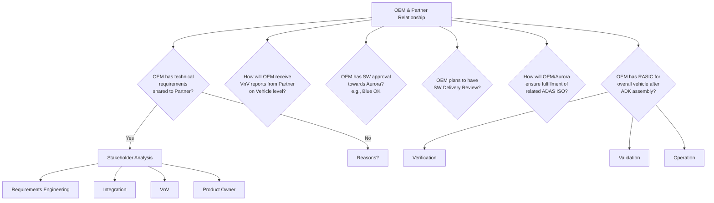

```mermaid
flowchart TD
    A[OEM & Partner Relationship]
    
    A --> B{OEM has technical\nrequirements\nshared to Partner?}
    
    B -->|Yes| C[Stakeholder Analysis]
    C --> C1[Requirements Engineering]
    C --> C2[Integration]
    C --> C3[VnV]
    C --> C4[Product Owner]
    
    B -->|No| D[Reasons?]
    
    A --> E{How will OEM receive\nVnV reports from Partner\non Vehicle level?}
    
    A --> F{OEM has SW approval\ntowards Aurora?\ne.g., Blue OK}
    
    A --> G{OEM plans to have\nSW Delivery Review?}
    
    A --> H{How will OEM/Aurora\nensure fulfillment of\nrelated ADAS ISO?}
    
    A --> I{OEM has RASIC for\noverall vehicle after\nADK assembly?}
    I --> I1[Verification]
    I --> I2[Validation]
    I --> I3[Operation]
```
